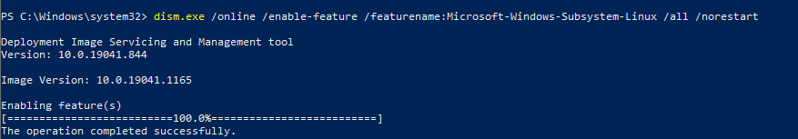
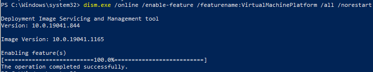
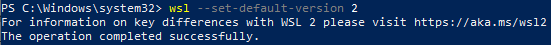
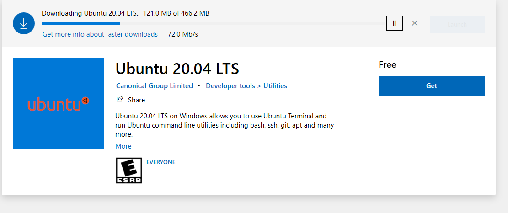
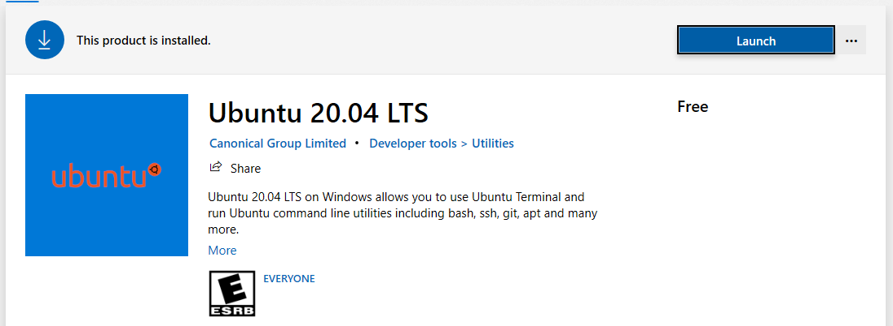
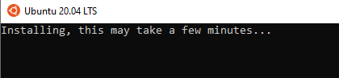
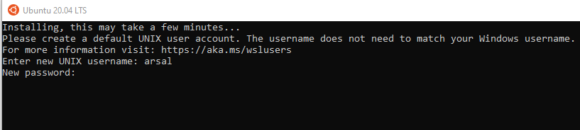
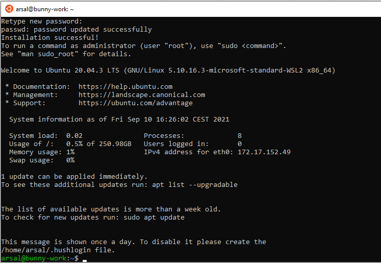
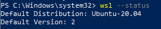
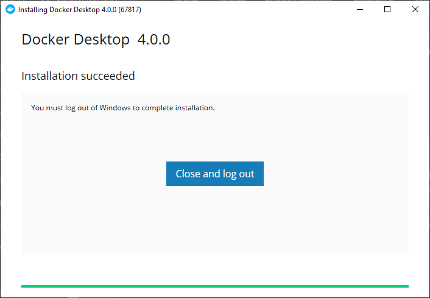

# Install Docker Desktop on Windows

Either WSL 2 or hyper-V are required to install Docker desktop on windows. We are installing using WSL2 as it supports more windows 10 versions - including Windows 10 Home, Education, Enterprise, and Pro. 

If you prefer to use Hyper-V instead, please refer to https://docs.microsoft.com/en-us/virtualization/hyper-v-on-windows/quick-start/enable-hyper-v. Note: Hyper-V is only supported by Windows 10 64-bit: Pro 2004 (build 19041) or higher, or Enterprise or Education 1909 (build 18363) or higher.

# Install WSL 2 on Windows 10

- The following hardware prerequisites are required to successfully run WSL 2 on Windows 10:
    1. 64-bit processor with Second Level Address Translation (SLAT)
    1. 4GB system RAM
    1. BIOS-level hardware virtualization support must be enabled in the BIOS settings. For more information, see [Virtualization](https://docs.docker.com/desktop/windows/troubleshoot/#virtualization-must-be-enabled).


<strong>Follow the six steps listed below to manually install Linux on any version of Windows 10.</strong>

## Step 1 - Enable the Windows Subsystem for Linux

You must first enable the "Windows Subsystem for Linux" optional feature before installing any Linux distributions on Windows.

Open PowerShell as Administrator and run:

`dism.exe /online /enable-feature /featurename:Microsoft-Windows-Subsystem-Linux /all /norestart`




## Step 2 - Check requirements for running WSL 2

To update to WSL 2, you must be running Windows 10.

- For x64 systems: Version 1903 or higher, with Build 18362 or higher.
- For ARM64 systems: Version 2004 or higher, with Build 19041 or higher.
- Builds lower than 18362 do not support WSL 2.

Use the Windows Update Assistant to update your version of Windows. Select Windows logo key + R, type `ms-settings:windowsupdate`, select OK.

<blockquote>
To check your version and build number, select Windows logo key + R, type winver, select OK. Update to the latest Windows version in the Settings menu.
</blockquote>

## Step 3 - Enable Virtual Machine feature

Before installing WSL 2, you must enable the Virtual Machine Platform optional feature. Your machine will require virtualization capabilities to use this feature.

Open PowerShell as Administrator and run:

```
dism.exe /online /enable-feature /featurename:VirtualMachinePlatform /all /norestart
```



<blockquote>
Restart your machine to complete the WSL install and update to WSL 2.
</blockquote>

## Step 4 - Download the Linux kernel update package

1. Check your machine type:
    - open Command Prompt or PowerShell and enter: `systeminfo | find "System Type"`. Caveat: On non-English Windows versions, you might have to modify the search text, for example, in German it would be `systeminfo | find "Systemtyp"`.
1. Download the latest package for WSL2:
    - for x64 machines: https://wslstorestorage.blob.core.windows.net/wslblob/wsl_update_x64.msi
    - for ARM646 machines: https://wslstorestorage.blob.core.windows.net/wslblob/wsl_update_arm64.msi
1. Run the update package downloaded in the previous step. (Double-click to run - you will be prompted for elevated permissions, select ‘yes’ to approve this installation.)

Once the installation is complete, move on to the next step - setting WSL 2 as your default version when installing new Linux distributions.

## Step 5 - Set WSL 2 as your default version

Open PowerShell and run this command to set WSL 2 as the default version when installing a new Linux distribution:

```
wsl --set-default-version 2
```



## Step 6 - Install your Linux distribution of choice

Open the Microsoft Store and select your favorite Linux distribution. 
1. [Click here](https://aka.ms/wslstore), or open `Microsoft Store` from your start menu.
1. Search for `Ubuntu 20.04 LTS`. Open and click on blue 'Get' button.
    

1. click on blue 'Launch' button.

    

1. It will start the Ubuntu installation.

    

1. Enter your desired username and password.

    

1. When its complete, you should be able to see this screen.

    

1. You can test you installation using this command in Powershell: `wsl --status`. You should be able to see Default Version: `2` and the default distribution: `Ubuntu-20.04`.

    

<blockquote>
CONGRATULATIONS! You've successfully installed and set up a Linux distribution that is completely integrated with your Windows operating system!
</blockquote>

# Install Docker Desktop

The Docker Desktop installation includes Docker Engine, Docker CLI client, Docker Compose, Docker Content Trust, Kubernetes, and Credential Helper.

Follow these steps to install:

1. Download "Docker Desktop for Windows" from [here](https://desktop.docker.com/win/stable/amd64/Docker%20Desktop%20Installer.exe).
1. Double-click `Docker Desktop Installer.exe` to run the installer.
1. When prompted, ensure the `Enable Hyper-V Windows Features` or the `Install required Windows components for WSL 2` option is selected on the Configuration page.
1. Follow the instructions on the installation wizard to authorize the installer and proceed with the install.
1. When the installation is successful, click Close to complete the installation process.
1. If your admin account is different to your user account, you must add the user to the docker-users group. Run `Computer Management` as an administrator and navigate to `Local Users` and `Groups` > `Groups` > `docker-users`. Right-click to add the user to the group. Log out and log back in for the changes to take effect.

You will see this window when it succeeds:



## Optional: Enable running windows containers

Enter this command in PowerShell (as admin):

<blockquote>
Enable-WindowsOptionalFeature -Online -FeatureName $("Microsoft-Hyper-V", "Containers") -All
</blockquote>

## Sources:

1. https://docs.docker.com/desktop/windows/install
1. https://docs.microsoft.com/en-us/windows/wsl/install-win10#manual-installation-steps